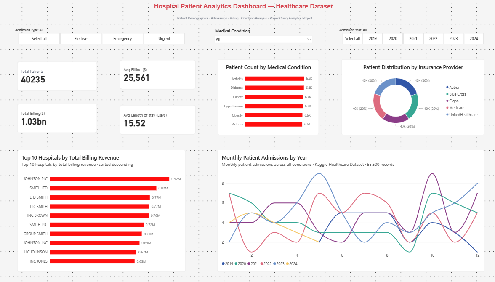
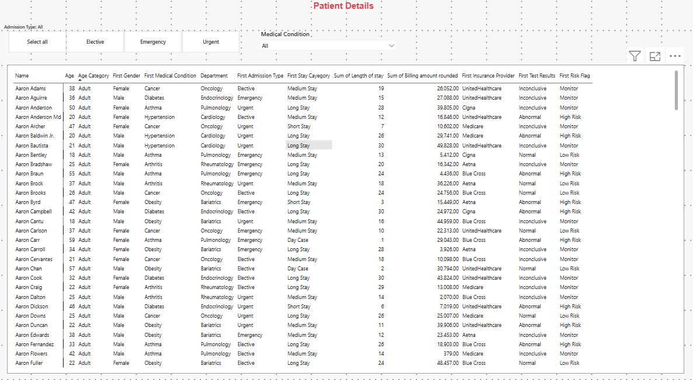
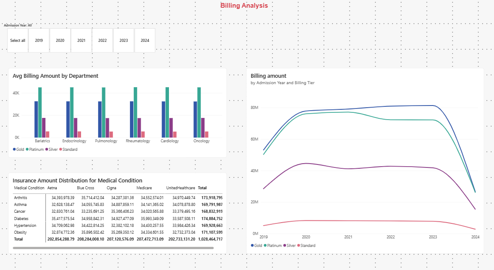

# 🏥 Hospital Patient Analytics Dashboard

<div align="center">


**A comprehensive 3-page Power BI dashboard delivering deep insights into hospital patient demographics, clinical admissions, billing performance, and insurance distribution — built on a 55,500-record Kaggle healthcare dataset.**

</div>

---

## 📸 Dashboard Preview

### Page 1 — Patient Analytics Overview


> *Filters: Admission Type · Medical Condition · Admission Year. Visuals: KPI cards, patient count by condition, top hospitals by revenue, monthly admission trends, insurance distribution.*

---

### Page 2 — Patient Details


> *Drill-down patient-level table with name, age, condition, department, admission type, stay category, billing, insurance provider, test results, and risk flag.*

---

### Page 3 — Billing Analysis


> *Avg billing by department and billing tier, billing trends by year, and full insurance amount matrix across all conditions and providers.*

---

## 📊 Key Metrics at a Glance

| Metric | Value |
|---|---|
| 🏥 **Total Patients** | 40,235 |
| 💰 **Total Billing** | $1.03 Billion |
| 📋 **Avg Billing per Patient** | $25,561 |
| 🛏️ **Avg Length of Stay** | 15.52 Days |
| 📁 **Source Records** | 55,500 (Kaggle) |
| 📅 **Data Range** | 2019 – 2024 |

---

## 🗂️ Files & Repository Structure

```
healthcare-dashboard/
│
├── 📄 README.md                        ← You are here
│
├── 📊 Data/
│   ├── healthcare_dataset.csv          ← Primary dataset (55,500 records)
│   └── Condition_Dept_Lookup.csv       ← Condition → Department mapping table
│
├── 📑 healthcare_dashboard.pdf         ← Static PDF export of all 3 pages
│
└── 🖼️ Screenshots/
    ├── hc_pg1.png                      ← Page 1: Patient Analytics Overview
    ├── hc_pg2.png                      ← Page 2: Patient Details Table
    └── hc_pg3.png                      ← Page 3: Billing Analysis
```

---

## 🗃️ Dataset Reference

### `healthcare_dataset.csv` — Primary Dataset
**55,500 rows · Source: [Kaggle Healthcare Dataset](https://www.kaggle.com/)**

| Column | Type | Description |
|---|---|---|
| `Name` | Text | Patient full name |
| `Age` | Integer | Patient age |
| `Gender` | Text | Male / Female |
| `Blood Type` | Text | ABO blood group (A+, B−, O+, etc.) |
| `Medical Condition` | Text | Primary diagnosis (see conditions below) |
| `Date of Admission` | Date | Hospital admission date |
| `Doctor` | Text | Attending physician |
| `Hospital` | Text | Hospital name |
| `Insurance Provider` | Text | Aetna · Blue Cross · Cigna · Medicare · UnitedHealthcare |
| `Billing Amount` | Decimal | Total billed amount in USD |
| `Room Number` | Integer | Assigned room |
| `Admission Type` | Text | Elective · Emergency · Urgent |
| `Discharge Date` | Date | Date of discharge |
| `Medication` | Text | Primary medication prescribed |
| `Test Results` | Text | Normal · Abnormal · Inconclusive |

---

### `Condition_Dept_Lookup.csv` — Lookup Table
*Used in Power Query to map each medical condition to its clinical department.*

| Medical Condition | Department |
|---|---|
| Cancer | Oncology |
| Diabetes | Endocrinology |
| Hypertension | Cardiology |
| Obesity | Bariatrics |
| Asthma | Pulmonology |
| Arthritis | Rheumatology |

---

## 📈 Dashboard Pages — Detailed Breakdown

### 🔵 Page 1 — Patient Analytics Overview

**Filters available across all visuals:**
- Admission Type: `Select All` · `Elective` · `Emergency` · `Urgent`
- Medical Condition: Dropdown (All or individual condition)
- Admission Year: `Select All` · `2019` · `2020` · `2021` · `2022` · `2023` · `2024`

**KPI Cards:**

| Card | Value |
|---|---|
| Total Patients | 40,235 |
| Total Billing ($) | $1.03bn |
| Avg Billing ($) | $25,561 |
| Avg Length of Stay (Days) | 15.52 |

**Patient Count by Medical Condition** *(Horizontal bar chart)*

| Condition | Patient Count |
|---|---|
| Arthritis | 6.8K |
| Diabetes | 6.8K |
| Cancer | 6.7K |
| Hypertension | 6.7K |
| Obesity | 6.6K |
| Asthma | 6.6K |

**Patient Distribution by Insurance Provider** *(Donut chart)*
- All 5 providers hold an equal ~20% share (~40K patients each): Aetna, Blue Cross, Cigna, Medicare, UnitedHealthcare

**Top 10 Hospitals by Total Billing Revenue** *(Sorted descending)*

| Rank | Hospital | Revenue |
|---|---|---|
| 1 | Johnson PLC | $0.92M |
| 2 | Smith Ltd | $0.82M |
| 3 | Ltd Smith | $0.77M |
| 4 | LLC Smith | $0.77M |
| 5 | Inc Brown | $0.76M |
| 6 | Smith PLC | $0.72M |
| 7 | Group Smith | $0.71M |
| 8 | Johnson Inc | $0.69M |
| 9 | LLC Johnson | $0.67M |
| 10 | Inc Jones | $0.65M |

**Monthly Patient Admissions by Year** *(Multi-line time series)*
- Tracks monthly admission volume per year (2019–2024) across all conditions, revealing seasonal admission patterns and year-over-year trends.

---

### 🟡 Page 2 — Patient Details

An interactive, filterable patient-level table for granular drill-down.

**Columns displayed:**

| Column | Description |
|---|---|
| Name | Patient full name |
| Age | Patient age |
| Age Category | Adult / Senior / etc. |
| First Gender | Gender |
| First Medical Condition | Primary diagnosis |
| Department | Mapped via lookup table |
| First Admission Type | Elective / Emergency / Urgent |
| First Stay Category | Day Case · Short Stay · Medium Stay · Long Stay |
| Sum of Length of Stay | Total days hospitalized |
| Sum of Billing Amount | Total billed (rounded) |
| First Insurance Provider | Insurance carrier |
| First Test Results | Normal · Abnormal · Inconclusive |
| First Risk Flag | Low Risk · Monitor · High Risk |

**Filters:** Admission Type buttons + Medical Condition dropdown (consistent with Page 1)

---

### 🔴 Page 3 — Billing Analysis

**Filter:** Admission Year selector (2019–2024)

**Avg Billing Amount by Department** *(Grouped bar chart — 4 billing tiers)*
- Departments: Bariatrics · Endocrinology · Pulmonology · Rheumatology · Cardiology · Oncology
- Billing tiers: Gold · Platinum · Silver · Standard
- Platinum tier consistently shows the highest avg billing (~$40K+) across all departments

**Billing Amount by Admission Year and Billing Tier** *(Multi-line area chart)*
- Gold and Platinum tiers dominate ($60M–$80M range, peaking ~2022–2023)
- Silver tier holds ~$40M range
- Standard tier remains the lowest (~$5M–$10M range)
- All tiers show a sharp decline in 2024 (possible data recency effect)

**Insurance Amount Distribution by Medical Condition** *(Cross-tab matrix)*

| Condition | Aetna | Blue Cross | Cigna | Medicare | UnitedHealthcare | **Total** |
|---|---|---|---|---|---|---|
| Arthritis | $34.4M | $35.7M | $34.3M | $34.6M | $35.0M | **$173.9M** |
| Asthma | $32.6M | $34.1M | $34.9M | $34.1M | $34.1M | **$169.8M** |
| Cancer | $32.8M | $33.2M | $35.4M | $34.0M | $33.4M | **$168.8M** |
| Diabetes | $35.4M | $35.0M | $34.9M | $36.0M | $33.6M | **$174.9M** |
| Hypertension | $34.7M | $34.4M | $32.4M | $34.4M | $34.0M | **$169.9M** |
| Obesity | $32.9M | $35.9M | $35.3M | $34.3M | $32.7M | **$171.1M** |
| **Total** | **$202.9M** | **$208.3M** | **$207.1M** | **$207.5M** | **$202.7M** | **$1.028B** |

---

## 💡 Key Insights

- 🩺 **Conditions are evenly distributed** — all 6 conditions each account for roughly 1/6 of patients (~6.6K–6.8K), making this ideal for cross-condition benchmarking
- 🏦 **Insurance providers contribute equally** — each of the 5 providers covers ~20% of patients and contributes ~$202M–$208M in total billing
- 🏆 **Diabetes generates the highest total insurance billing** at $174.9M; Cancer is the lowest at $168.8M
- 📉 **2024 shows a billing decline** across all tiers in the time series — likely a partial-year data effect
- 🏥 **"Johnson PLC" leads hospital revenue** at $0.92M, nearly 40% ahead of the 10th-ranked hospital ($0.65M)
- ⚠️ **High Risk patients** are identifiable via the `First Risk Flag` column on Page 2 (correlated with Abnormal test results + Urgent admissions)
- 🛏️ **Average stay of 15.52 days** skews toward non-elective, longer-term admissions

---

## 🛠️ Power Query & Data Transformation

This project uses **Power Query** for all data preparation:

| Step | Description |
|---|---|
| **Lookup Join** | Left join `healthcare_dataset` with `Condition_Dept_Lookup` on `Medical Condition` to add `Department` |
| **Age Category** | Derived column bucketing `Age` into Adult / Senior groups |
| **Stay Category** | Day Case (≤2 days) · Short Stay (≤7) · Medium Stay (≤21) · Long Stay (>21) |
| **Risk Flag** | Derived from `Test Results` + `Admission Type` logic → Low Risk / Monitor / High Risk |
| **Billing Tier** | Banded classification of `Billing Amount` → Gold / Platinum / Silver / Standard |
| **Year & Month** | Extracted from `Date of Admission` for time-series slicing |
| **Name Normalization** | Proper case applied to raw names (source had mixed casing e.g. `BobBy JacksOn`) |

---

## 🚀 Getting Started

### Prerequisites
- [Power BI Desktop](https://powerbi.microsoft.com/desktop/) (free download)

### Setup Steps

```
1. Clone or download this repository

2. Open Power BI Desktop
   → Home → Get Data → Text/CSV
   → Load: healthcare_dataset.csv

3. Load the lookup table
   → Home → Get Data → Text/CSV
   → Load: Condition_Dept_Lookup.csv

4. In Power Query Editor:
   → Merge Queries (Left Join) on [Medical Condition] = [Condition]
   → Expand to bring in the [Department] column
   → Add derived columns: Age Category, Stay Category, Risk Flag, Billing Tier
   → Extract Year and Month from [Date of Admission]
   → Close & Apply

5. Build visuals as shown in the screenshots
   → Use the PDF export as a layout reference
```

---

## 🧰 Tech Stack

| Tool | Purpose |
|---|---|
| **Microsoft Power BI Desktop** | Dashboard development & visualization |
| **Power Query (M language)** | Data transformation, joins & derived columns |
| **DAX** | Calculated measures (KPIs, averages, billing totals) |
| **CSV** | Raw data storage & lookup reference |
| **Kaggle** | Dataset source |

---

## 📬 Contributing

Contributions, issues, and feature requests are welcome. Feel free to open an issue or submit a pull request.

---

<div align="center">

Built with ❤️ from **CHIRAG MODI** using Power BI &nbsp;·&nbsp; Source: Kaggle Healthcare Dataset · 55,500 records &nbsp;·&nbsp; 2019 – 2024

</div>
